<div align="center">


<h1> Pybicc💯</h1>

### 具有图形化界面的类C语言编译器 + 汇编代码解释器


[](https://github.com/TochusC/ai-assistant-teaching-website)
[](https://github.com/TochusC/ai-assistant-teaching-website)

[](https://github.com/TochusC/ai-assistant-teaching-website)


[**简体中文**](./README.md) | [**English**](./docs/en/README.md)


[中国石油大学(华东)](https://upc.edu.cn/)-编译原理课程设计-二组


---

<div align="center">

### 仍在火热施工中🔨...

项目参考自[Chibicc](https://github.com/rui314/chibicc)，感谢[rui314](https://github.com/rui314)的开源项目💖。

图形化界面采用Fluent 2设计风格，使用[PyQt6](https://riverbankcomputing.com/software/pyqt/intro)及[PyQt-Fluent-Widgets](https://github.com/zhiyiYo/PyQt-Fluent-Widgets)实现🌟。

</div>

</div>

---
支持的变量类型：int, char, short, long, bool, struct;

支持嵌套指针、函数调用、多维数组、结构体。

支持整数、字符串字面值常量

支持运算符：'+', '-', '*', '/', '<', '>', '=',"==", "!=", "<=", ">=", "->", "++", "--",
       "&&", "||", "<<=", ">>=", "<<", ">>",
       "*=", "/=", "%=", "+=", "-=", "&=", "^=", "|=", 
                 '!','&', '|', '~', '^', '.', 

支持IF-ELSE, FOR, WHILE SWITCH-CASE语句

提供READ，WRITE函数进行输入输出。

## 项目目标🎯：

   实现一个通过Python模仿的类C语言编译器，能够将C语言代码编译为Intel 80x86汇编代码，
   配有解释器,能够解释执行汇编代码得出运算结果。同时项目还提供了图形化界面，提供部分集成开发环境（IDE）的功能。

## 代码结构✨：


    - main.py           编译器程序入口

    - compiler\tokenize.py       词法分析，将源代码转换为链表存储的Token

    - compiler\parse.py:         语法分析，将Token转换为抽象语法树

    - compiler\codegen.py        语义生成，将抽象语法树转换为汇编代码

    - compiler\simulator.py      汇编代码解释器

    - gui\fluent.py      图形化界面入口

## 代码详解🔍

Pybicc项目由三大部分组成:
1. 编译器(tokenize.py、parse.py、codegen.py)
    
    - tokenize.py
      
      负责词法分析，解析C源代码，生成Token链表。
   
      以下是支持的关键字，运算符：

      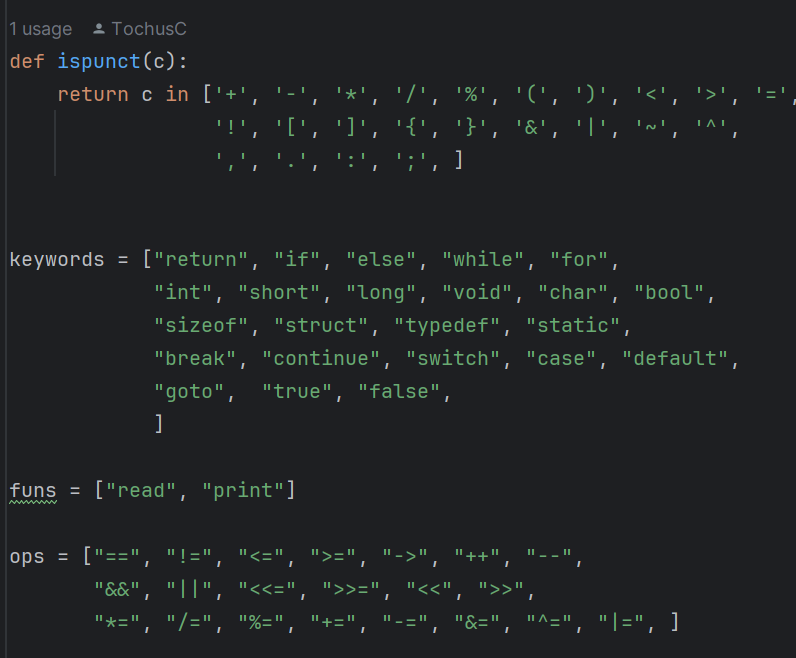

    - parse.py
      
      使用**LL(1)文法分析**，根据语法分析生成的Token链表，建立抽象语法树（AST）。
      
      语法生成规则：
      ```
      - program    = (typedef | global-var | function )*
      - typedef    = typdef basetype ident ";"
      - global-var = global-var = basetype declaration type-suffix ";"
      - function   = basetype declarator "(" params? ")" ("{" stmt* "}" | ";")
      - params     = param ("," param)*
      - param      = basetype declarator type-suffix 
      - basetype   = basetype = builtin-type | struct-decl | typedef  "*"*
      - builtin-type = "void" | "bool" | "char" | "short" | "int" | "long"
      - struct-decl  = "struct" ident? ("{" struct-member "}")?
      - declaration  = basetype ident ("[" num "]")* ("=" expr) ";"| basetype ";"
      -  stmt        = "return" expr ";"                                                       
                       | "if" "(" expr ")" stmt ("else" stmt)?                                    
                       | "switch" "(" expr ")" stmt                                               
                       | "case" num ":" stmt                                                      
                       | "default" ":" stmt                                                       
                       | "while" "(" expr ")" stmt                                                
                       | "for" "(" (expr? ";" | declaration) expr? ";" expr? ")" stmt             
                       | "{" stmt* "}"                                                            
                       | "typedef" basetype ident ("[" num "]")* ";"                              
                       | "break" ";"                                                              
                       | "continue" ";"                                                           
                       | "goto" ident ";"                                                         
                       | ident ":" stmt                                                           
                       | declaration                                                              
                       | expr ";"    
      - expr       = assign ("," assign)*
      - assign     = logor (assign-op assign)?
      - assign-op  = "=" | "+=" | "-=" | "*=" | %= | "/=" | "<<=" | ">>="
      - equality   = relational ("==" relational | "!=" relational)* 
      - relational = shift ("<" shift | "<=" shift | ">" shift | ">=" shift)*
      - shift      = add ("<<" add | ">>" add)*  
      - add        = mul ("+" mul | "-" mul)*   
      - mul        = cast ("*" cast | "/" cast | "%" cast)*  
      - cast       = "(" type-name ")" cast | unary  
      - unary      = ("+" | "-" | "*" | "&" | "!")? cast             
                   | ("++" | "--") unary                                   
                   | postfix   
      - postfix    = primary ("[" expr "]" | "." ident | "->" ident | "++" | "--")*
      - primary    = "(" expr ")"    
                   | "sizeof" unary  
                   | ident func-args?
                   | str             
                   | num             
      ```
    - codegen.py
      
      根据语法分析生成的抽象语法树，进行语义分析，翻译为Intel80x86汇编语言
   
      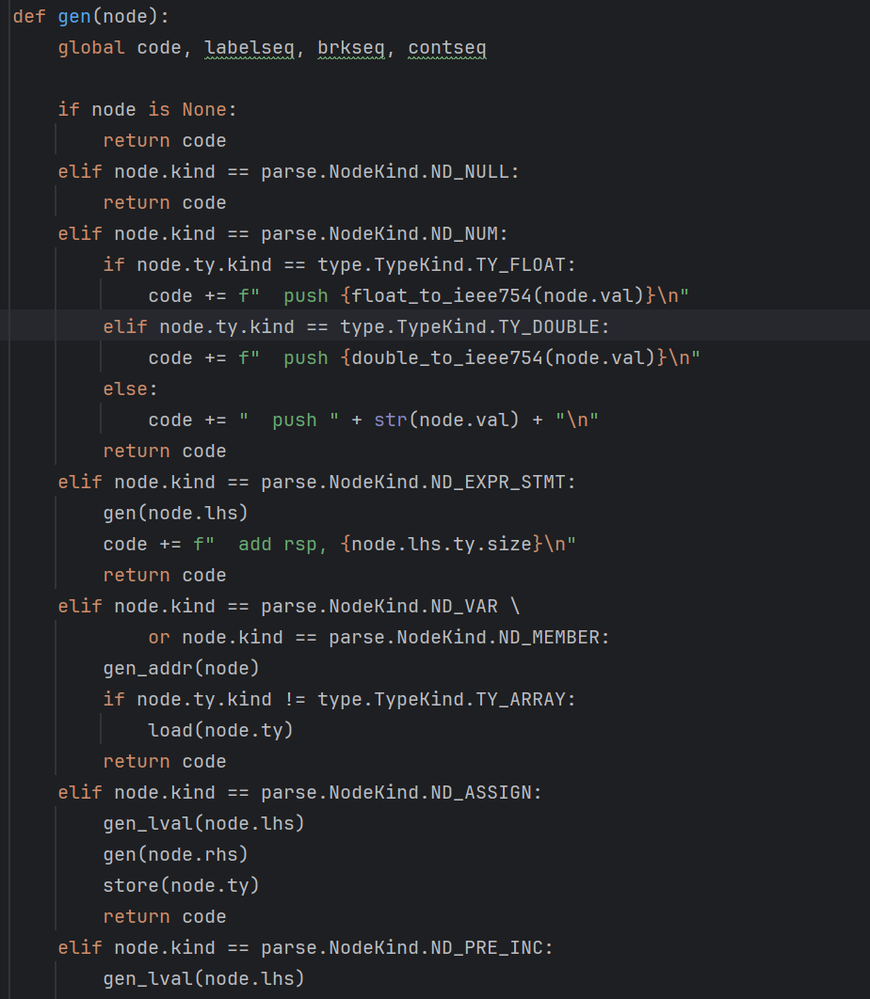
   
2. 解释器(interpreter.py)
   
   为了在图形化界面（GUI）中得到运行结果，我们还额外编写了用于解释执行Intel80x86汇编语言的解释器，
   
   其依据汇编语言，逐行解释执行指令，模拟相关操作。

   解释器以字节级别模拟实现了对存储器的访问存取，每个单元存储一个字节的数据，并实现了ALU的相应计算功能。
   
   解释器有着若干重要的全局变量：
   1. glb_vars - 记录程序运行中的全局变量
   2. glb_funcs - 记录所有全局可见函数
   3. CURRENT_FUNC - 当前运行的函数名
   4. RUNNING_COMMAND_LINE_INDEX - 当前运行的指令行号
   - 解释器在模拟运行之前会先解析一遍汇编代码，处理数据段，文本段的相关内容，并将代码段中的所有函数相关信息（入口、标识符）记录至全局变量`glb_func`中。
    
     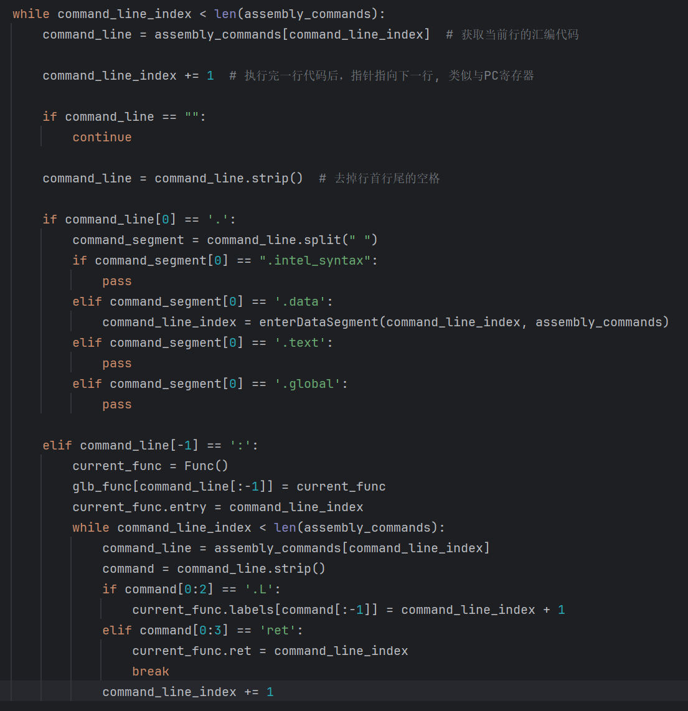
     
   - `enterDataSegment`函数用于处理数据段，将数据段中的数据存储至内存中。
    
     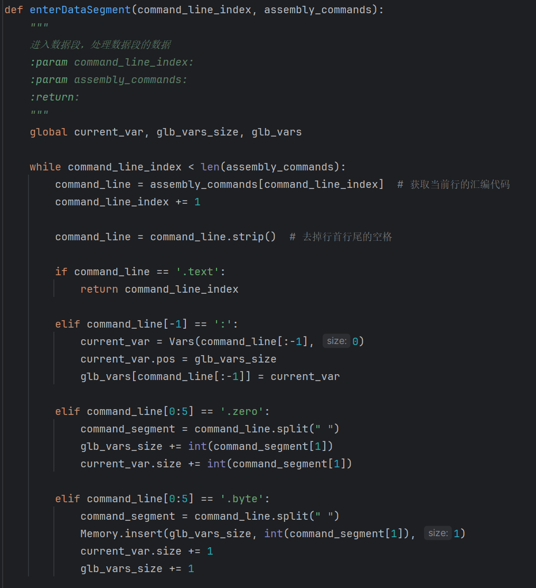
     
   - 解释器再解析完汇编代码后，会从`glb_func`中找到main函数的入口，并通过把全局变量`RUNNING_COMMAND_LINE_INDEX`
    设置main函数的入口开始模拟执行汇编代码。
    
     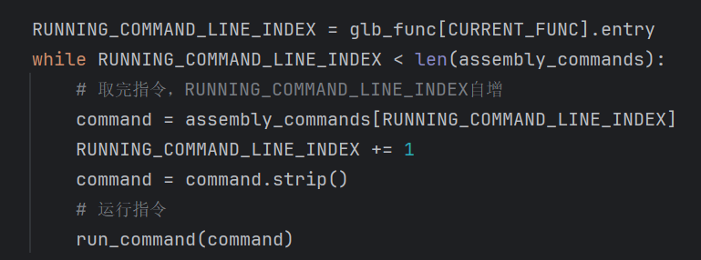
     
   - `run_command()`函数用于模拟执行汇编代码，根据指令的操作码，调用相应的函数模拟执行指令。
    
     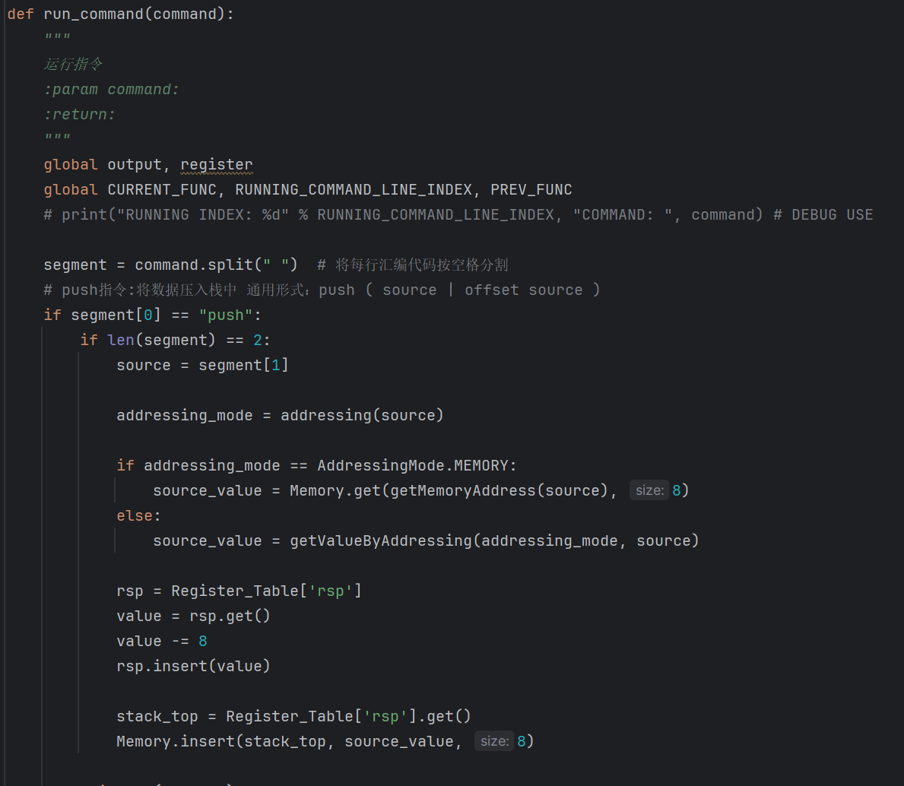
     
   - 寄存器（Register）
     
     寄存器使用类进行模拟，所有寄存器（如rax,rbp,rsp）均为Register类的实例，访问存取通过成员函数提供的接口实现，所有实例共享shared_storage（存储空间）变量。
     由此实现多个不同大小寄存器（rax,eax,ax,al）使用同一存储区域的特性。
   
     
     
   - 内存（Memory）

     内存使用Memory类进行模拟，访问存取通过成员函数提供的接口实现。
    
     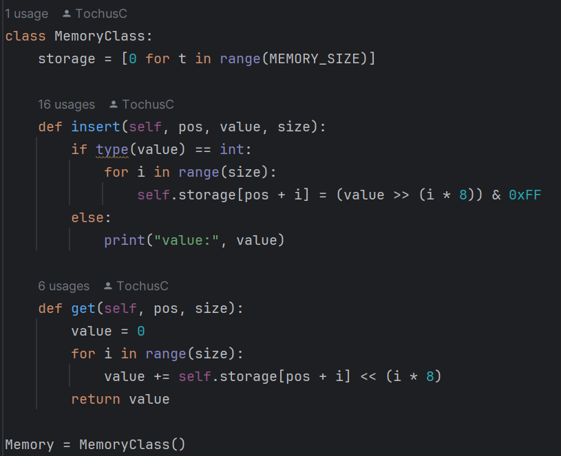
     
   - 模拟支持的指令
     - push ( source | offset source )
     - pop destination
     - add destination, source
     - sub destination, source
     - imul destination, source
     - idiv operand
     - cqo
     - cmp operand1 operand2
     - sete destination
     - setne destination
     - setl destination
     - setle destination
     - mov destination, source
     - movzb destination, source
     - movsx destination, source
     - movss destination, source
     - movsd destination, source
     - lea destination, source
     - and destination, source
     - or destination, source
     - not destination
     - xor destination, source
     - shl destination, source
     - shr destination, source
     - sal destination, source
     - sar destination, source
     - jnz label
     - je label
     - jne label
     - call label
     - ret
   - 在模拟指令运行时，解释器会将指令操作数送至`addresing`函数获取操作数的寻址方式，然后根据寻址方式
    使用`Memory.get(pos,size)`从内存获取操作数的值，或使用`getValueByAddressing`获取操作数的值。
    
     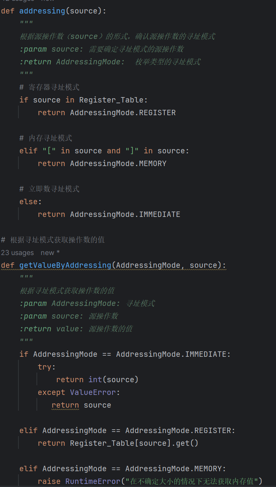
     
   - 在内存寻址时，通过`getMomoryAddress(expr)`获得内存地址，`getMomoryAddress(expr)`会根据表达式，转换为前缀表达式形式，计算出表达式的值，然后根据值计算出内存地址。
    
     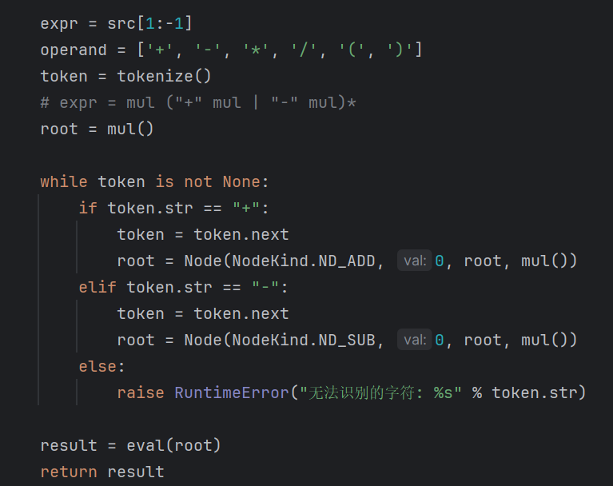
    
4. 图形化界面(GUI)
   
    图形化界面采用Fluent 2设计风格，使用[PyQt6](https://riverbankcomputing.com/software/pyqt/intro)及[PyQt-Fluent-Widgets](https://github.com/zhiyiYo/PyQt-Fluent-Widgets)实现，并提供了部分集成开发环境（IDE）的功能。
    
    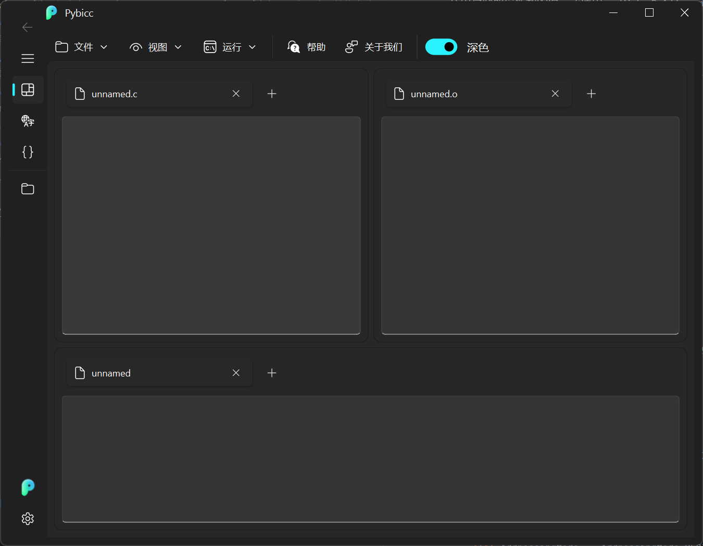

    图形化界面主要分为四大视图：总览视图，词法分析视图，语法分析视图，文件视图。
    - 总览视图：显示总体功能，左上边框显示C源代码，右上边框显示编译后的汇编代码，下边框显示解释执行的结果。
      
      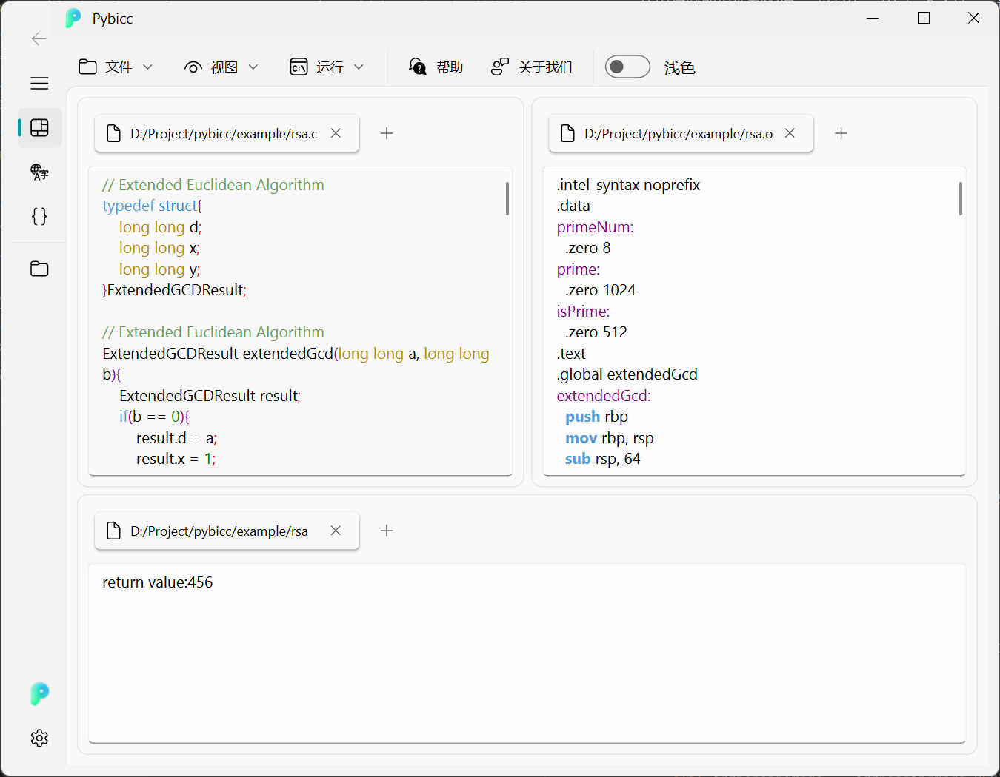
    - 词法分析视图：显示词法分析的结果，左边框显示源代码，右边框显示词法分析的结果。
      
      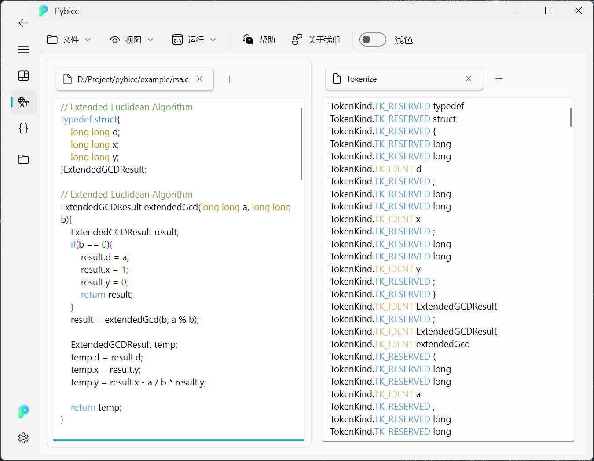
      
    - 语法分析视图：显示语法分析的结果，左边框显示源代码，右边框显示语法分析的结果。
      
      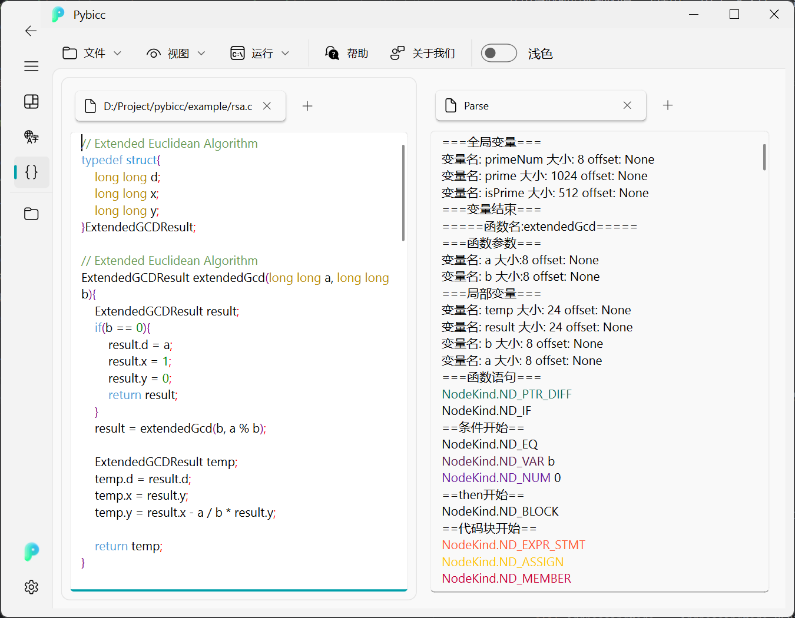
      
    - 文件视图：显示文件的目录结构，通过双击文件可打开文件。
      
      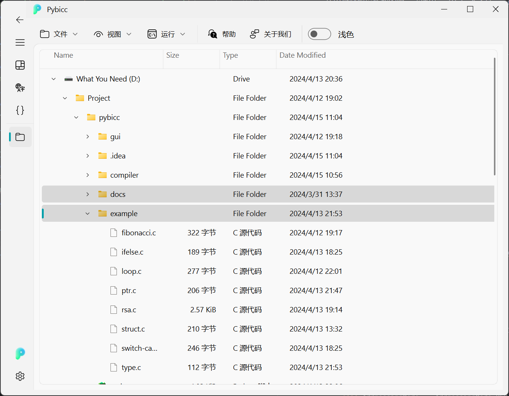
    
    图形化界面提供了代码编辑器，汇编语言编辑器功能，同时支持深色模式，多文件打开与切换，文件保存等功能。
    - 代码编辑器：支持代码高亮，代码折叠，代码提示，代码补全等功能。
    - 汇编语言编辑器：支持汇编语言的编辑，高亮，折叠，提示等功能。
    - 词法分析结果高亮，语法分析结果高亮。
   
    图形化界面的开发引入了**生命周期**的概念，通过生命周期管理，实现了界面刷新，数据更新等功能。
    
    

## 如何运行此项目❓


1. 安装[Python](https://www.python.org/), 本项目使用Python3.12.0开发。
2. 安装依赖
    ```shell
    pip install -r requirements.txt
    ```
1. main.py，提供了编译器和解释器使用范例。
    ```shell
    python main.py
    ```
1. interface\fluent.py，提供了Pybicc的图形化界面

    ```shell
    python interface\fluent.py
    ```
   
   

## 输入样例参考👾：

```
   int main() { int i=0; int j=0; for (i=0; i<=10; i=i+1) j=i+j; return j; }
```
```
   int main() { int a=3; int z=5; return a+z; }
```
```
   int main() { int x=3;int y=5; *(&x+8)=7; return y; }
```
