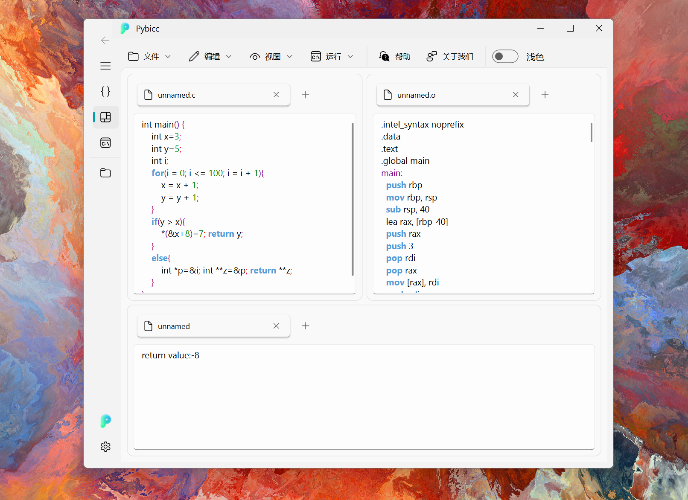

<div align="center">


<h1> Pybicc💯</h1>

### A Class-C Compiler with Graphical Interface + Assembly Code Interpreter


[](https://github.com/TochusC/ai-assistant-teaching-website)
[](https://github.com/TochusC/ai-assistant-teaching-website)

[](https://github.com/TochusC/ai-assistant-teaching-website)


[**简体中文**](./README.md) | [**English**](./docs/en/README.md)


[China University of Petroleum (East China)](https://upc.edu.cn/)-Compiler Theory Course Design-Group Two



---

<div align="center">

### Still Under Active Construction 🔨...

The project is inspired by [Chibicc](https://github.com/rui314/chibicc), thanks to [rui314](https://github.com/rui314) for the open-source project 💖.

The graphical interface adopts Fluent 2 design style and is implemented using [PyQt6](https://riverbankcomputing.com/software/pyqt/intro) and [PyQt-Fluent-Widgets](https://github.com/zhiyiYo/PyQt-Fluent-Widgets) 🌟.

</div>

</div>

---
Incomplete version, lacking interpreter implementation.

Supported variable types: int, char, int*, char*, int[], char[]

Run literal constants.

Supported operators: + - * / % == != < <= > >= && || ! = & ^

Supports pointers, dereferencing, function definition, and function invocation.

Supports IF-ELSE, FOR, WHILE statements

## Project Objectives 🎯:

   Implement a class C compiler mimicked by Python that can compile C language code into Intel 80x86 assembly code,
   equipped with an interpreter to interpret and execute assembly code to obtain computation results. The project also provides a graphical interface, offering some Integrated Development Environment (IDE) functionalities.

## Code Structure ✨:


    - main.py           Compiler program entry

    - compiler\tokenize.py       Lexical analysis, converting source code into Token stored in linked list

    - compiler\parse.py:         Syntax analysis, converting Token into Abstract Syntax Tree

    - compiler\codegen.py        Semantic generation, converting Abstract Syntax Tree into assembly code

    - compiler\simulator.py      Assembly code interpreter

    - gui\fluent.py      Graphical interface entry

## How to Run This Project ❓


1. Install [Python](https://www.python.org/), this project is developed using Python 3.12.0.
2. Install dependencies
    ```shell
    pip install -r requirements.txt
    ```
1. main.py, provides examples of using the compiler and interpreter.
    ```shell
    python main.py
    ```
1. interface\fluent.py, provides Pybicc's graphical interface

    ```shell
    python interface\fluent.py
    ```
   
   

## Input Sample References 👾:


```
   int main() { int i=0; int j=0; for (i=0; i<=10; i=i+1) j=i+j; return j; }
```
```
   int main() { int a=3; int z=5; return a+z; }
```
```
   int main() { int x=3;int y=5; *(&x+8)=7; return y; }
```
